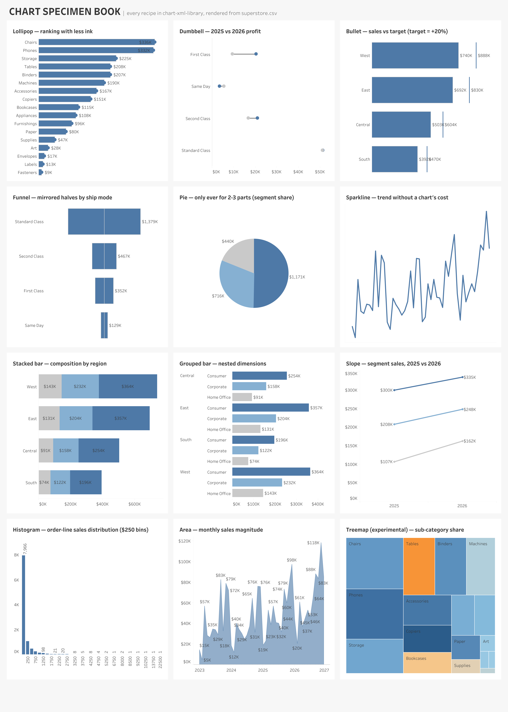

# vizwright

Ask for a Tableau dashboard. Get one.

vizwright is a multi-agent pipeline for [Claude Code](https://claude.com/claude-code).
Hand it a dataset and a question. It runs the analysis, designs against
data-viz best practices, writes the Tableau workbook as raw `.twb` XML, and
scores its own rendered output until it passes. Tableau Desktop never
enters the loop.



Every chart above was written as XML by an agent. [See the gallery](examples/).

## Quick start

```bash
git clone https://github.com/blakefeiza/vizwright
cd vizwright
claude
```

Then ask:

> Build a dashboard from data/superstore.csv answering: which regions
> should we focus on to grow profit?

You get an insights narrative, a design spec, and a validated `.twbx` to
open in Tableau. Add a free [Tableau Cloud dev site](https://developer.tableau.com)
to `.env` (copy `.env.example`) and the loop closes on its own: the agent
publishes, renders, scores against a 100-point rubric, fixes, repeats.
You review the finished dashboard.

Requirements: Claude Code, Python 3.11+ with pandas, and Tableau Desktop
or the free Tableau Public app to open results.

## Why it exists

Most "automatic insights" tools hand you chart soup. The hard problems
sit upstream of the chart: which story the data tells, which chart earns
its place, whether the result shows the craft that separates a Viz of
the Day from a default render.

vizwright keeps that craft in three skills files. Plain markdown. The
markdown is the product.

| Skill | What it knows |
|---|---|
| [`design-standards`](.claude/skills/design-standards/SKILL.md) | Visual hierarchy, color and line discipline, spacing, accessibility, plus the 100-point lint rubric |
| [`chart-xml-library`](.claude/skills/chart-xml-library/SKILL.md) | 20 render-verified chart recipes, organized by the question each one answers |
| [`twb-authoring`](.claude/skills/twb-authoring/SKILL.md) | The undocumented `.twb` XML grammar, learned from live Tableau load errors |

Four agents read those skills ([`.claude/agents/`](.claude/agents)): an
insights analyst, a dashboard designer, an XML author, and a design
linter. A static lint (`tools/lint_design.py`, 12 checks) rejects sloppy
output before a render exists, so the agents spend their iterations on
the story instead of chasing gridlines.

## Make it yours

The design standards here are opinionated defaults. Retrain them on your
taste:

1. **Mine your own corpus.** `python3 tools/mine_votd.py` pulls the recent
   Viz of the Day catalog; `tools/extract_patterns.py` takes winning
   workbooks apart into raw XML. Downloaded workbooks stay on your machine,
   never in this repo. See [`knowledge/README.md`](knowledge/README.md).
2. **Feed it your own work.** Drop your `.twbx` files into `knowledge/` and
   ask the agent to study them. That is how vizwright learned set actions,
   beeswarm table calcs, and dark maps from one Makeover Monday workbook.
3. **Edit the skills.** Your palette, your spacing, your chart opinions
   live in markdown. Change them and every future dashboard follows.
4. **Regenerate the specimen book.** `python3 tools/build_specimen.py`
   draws every recipe on one canvas, so you can see your whole design
   system at once.

## Tools

| Tool | Job |
|---|---|
| `tools/profile_data.py` | turns a dataset into a JSON profile the agents trust |
| `tools/validate_twb.py` | structural lint that catches what Tableau would refuse to load |
| `tools/lint_design.py` | 12 static design checks, the first-time-right gate |
| `tools/finalize_windows.py` | writes the one twb section too fiddly to hand-author, and auto-locks map sheets |
| `tools/package_twbx.py` | zips a twb plus its data into a twbx |
| `tools/publish_render.py` | publishes to Tableau Cloud and pulls back rendered PNGs |
| `tools/mine_votd.py`, `extract_patterns.py` | build your knowledge corpus |
| `tools/build_specimen.py` | the chart-recipe regression harness |

## Contributing

The skills improve the way they were built. You render something real,
learn grammar the docs skip, and write it down with proof. See
[CONTRIBUTING.md](CONTRIBUTING.md).

## Credits

Built by [Blake Feiza](https://public.tableau.com/app/profile/blakefeiza)
with Claude. Inspired by Matt Huff's agent-dashboard experiments and built
on [Will Sutton's Tableau Public MCP](https://github.com/wjsutton/tableau-public-mcp).
The design knowledge draws on the Tableau Public Viz of the Day gallery,
the FT Visual Vocabulary, and *Storytelling with Data*.

MIT licensed.
