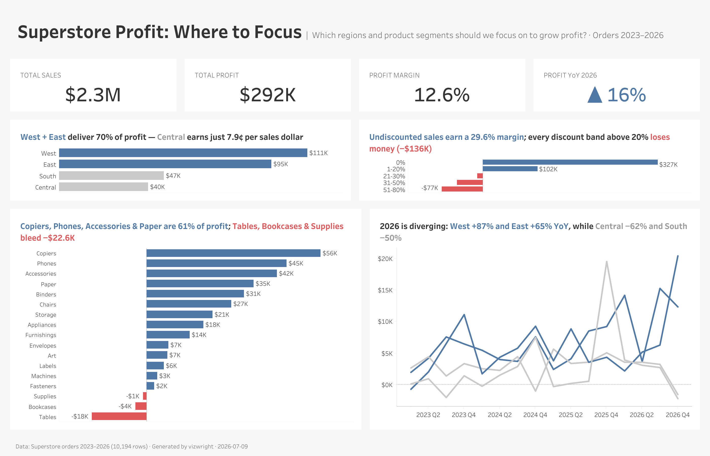
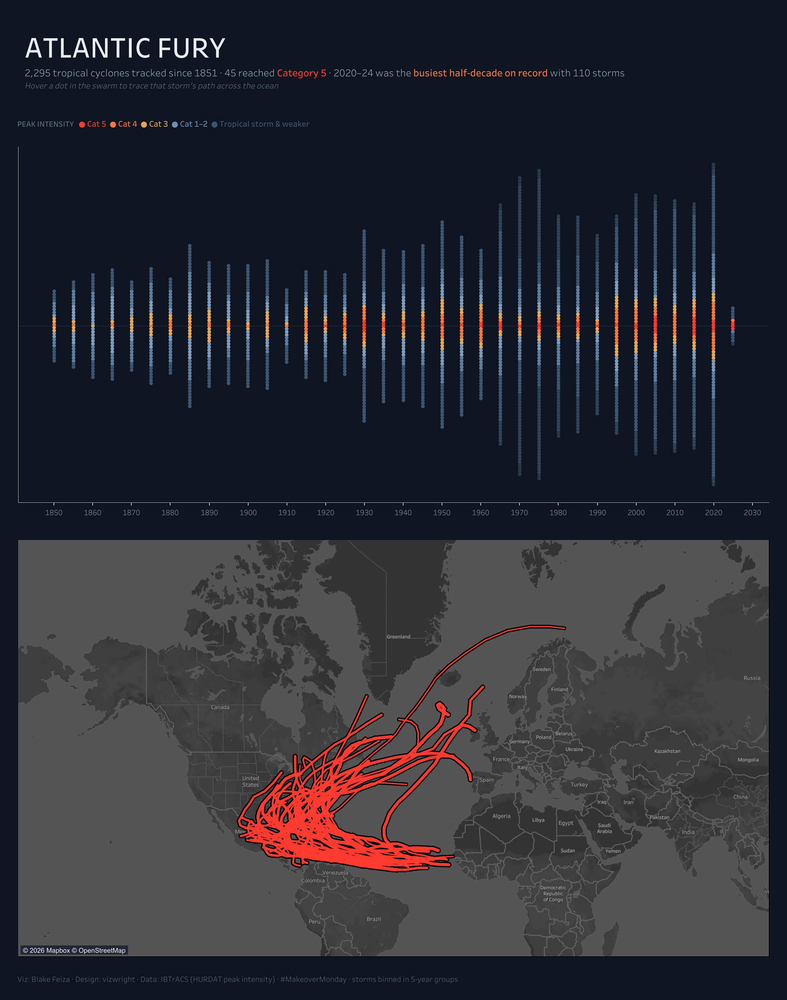

# Gallery

Every pixel below started as `.twb` XML an agent wrote.

| | |
|---|---|
|  | **Chart specimen book.** One command renders every recipe in the library (`tools/build_specimen.py`). Rerun it after changing a recipe: it doubles as the regression test. |
|  | **Business dashboard.** The full pipeline on Superstore, from insights to design spec to twb XML, through the lint loop to 96/100. |
|  | **Makeover Monday remake.** Dark theme, a beeswarm with intensity cores, and a set-action hover that traces one storm's path across a locked dark map. |
